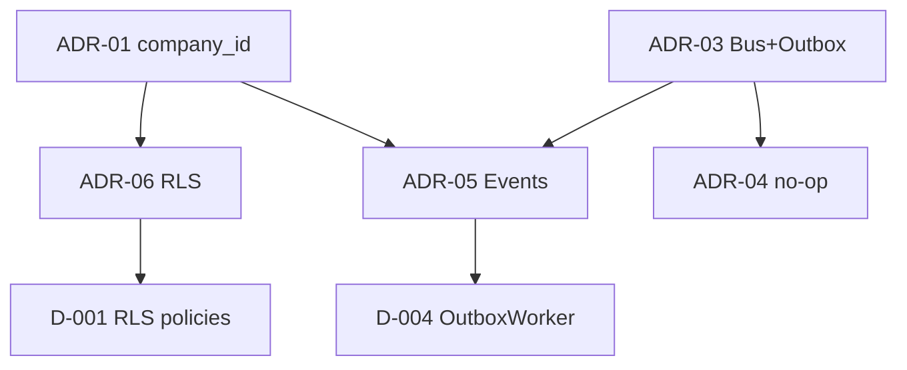

# Decision Center — Second Brain V2

> **Status:** OFICIAL • VIVO
> **Atualizado:** 2026-07-15
> **Propósito:** Banco permanente de decisões — toda decisão importante tem rastreabilidade.

---

## Estrutura

Cada decisão segue o template [[decisions/TEMPLATE-DECISION|TEMPLATE-DECISION]]:

- Problema
- Contexto
- Alternativas
- Decisão
- Justificativa
- Impacto
- Arquivos
- Relacionamentos
- Data

## Índice de Decisões

### Decisões Técnicas (ADRs)
| ID | Título | Status |
|---|---|---|
| ADR-01 | Multi-tenant por `company_id` | ✅ Vigente |
| ADR-02 | Sem ORM; SQL direto via `pg.Pool` | ✅ Vigente |
| ADR-03 | Event Bus volátil + Outbox durável | ✅ Vigente |
| ADR-04 | Outbox sem handler = no-op | ✅ Vigente |
| ADR-05 | EVENT CONTRACTS + Factory | ✅ Vigente |
| ADR-06 | RLS defesa em profundidade | 🟡 Em evolução |
| ADR-07 | Governança em `.opencodex/` | ✅ Vigente |
| ADR-08 | Windows + PowerShell | ✅ Vigente |
| ADR-09 | Controle de abuso obrigatório | ✅ Vigente |
| ADR-10 | Skills Supabase rejeitadas | ✅ Vigente |

### Decisões de Governança
| ID | Título | Data | Status |
|---|---|---|---|
| D-014 | Publicar `.opencodex` com ressalvas | 2026-06-23 | ✅ Decidido |
| D-015 | Fonte única do Segundo Cérebro | 2026-06-23 | ✅ Fase C fechada |

### Decisões Estratégicas
| ID | Título | Data | Status |
|---|---|---|---|
| SD-001 | Consolidar Barber primeiro | — | ✅ Vigente |
| SD-002 | BeautyGestor como 2º nicho | — | ✅ Vigente |
| SD-003 | Portugal como 1º mercado internacional | — | ✅ Vigente |

### Decisões Executivas Pendentes
| ID | Título | Responsável |
|---|---|---|
| D-001 | RLS: policies formais vs BYPASSRLS | Humano |
| D-002 | Redis: pagar vs aceitar in-memory | Humano |
| D-003 | WhatsApp: real vs mock | Humano |
| D-004 | OutboxWorker: break vs continue | Humano |
| D-005 | ClimaGestor: investir vs congelar | Humano |

## Decision Graph

O [[decisions/DECISION-GRAPH|🔀 Decision Graph]] é o mapa completo de decisões com contexto, alternativas, consequências, PRs, deploys e relacionamentos entre decisões.

## Referências

- [[decisions/DECISION-GRAPH]] — Mapa completo do grafo de decisões
- [[decisoes-arquiteturais]] — ADRs completas
- [[strategy/strategic-decision-log]] — Decisões estratégicas
- [[living-os/decisoes/decisoes-executivas]] — Decisões executivas pendentes
- [[status-dinamico]] — Estado atual
- [[product/README]] — Product Brain
- [[technical/README]] — Technical Brain
